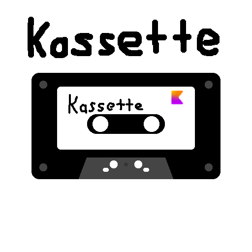
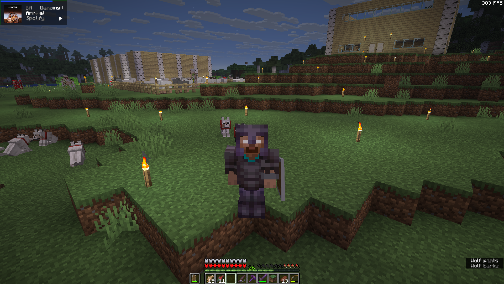
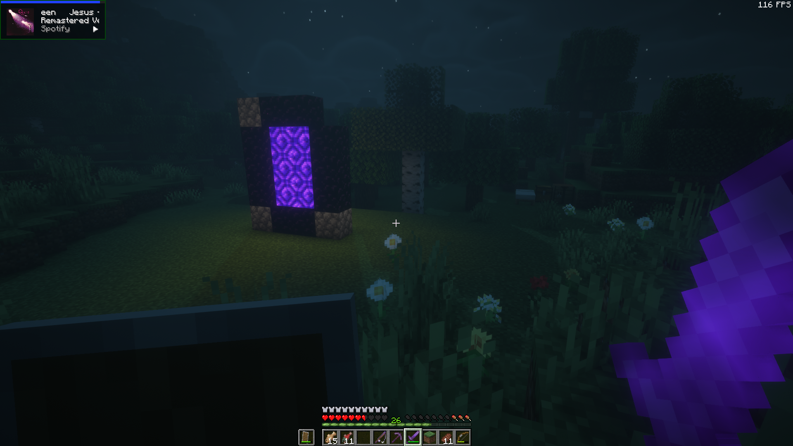
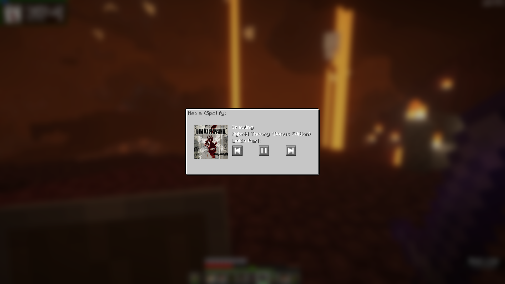

# Kassette
### Modern media information mod for Minecraft
 
Kassette allows you to see and control what is playing in the background, currently only Spotify is supported.

## Setup
You currently need:
- a Spotify account, preferably a *premium* account, free accounts are currently untested and aren't guaranteed to work
- a Spotify developer account with an app set up
- a working internet connection

## Screenshots

