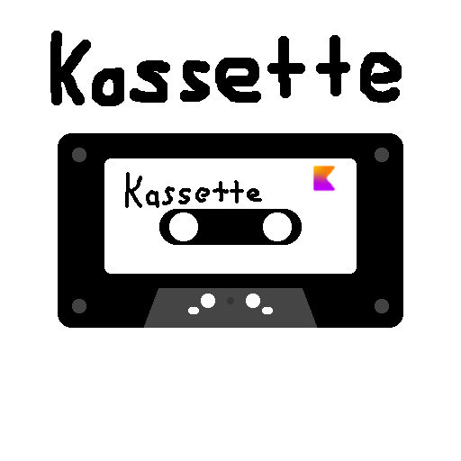
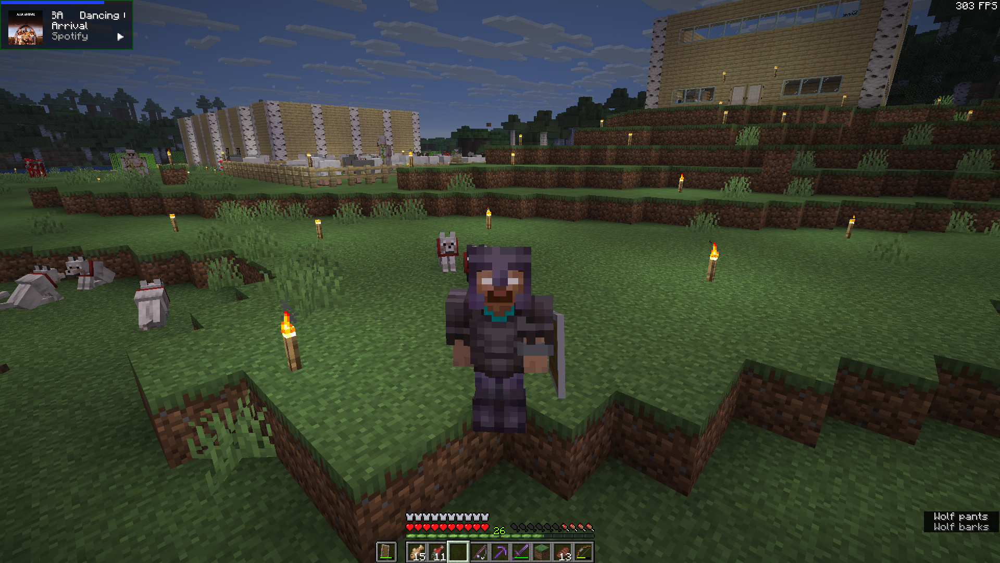
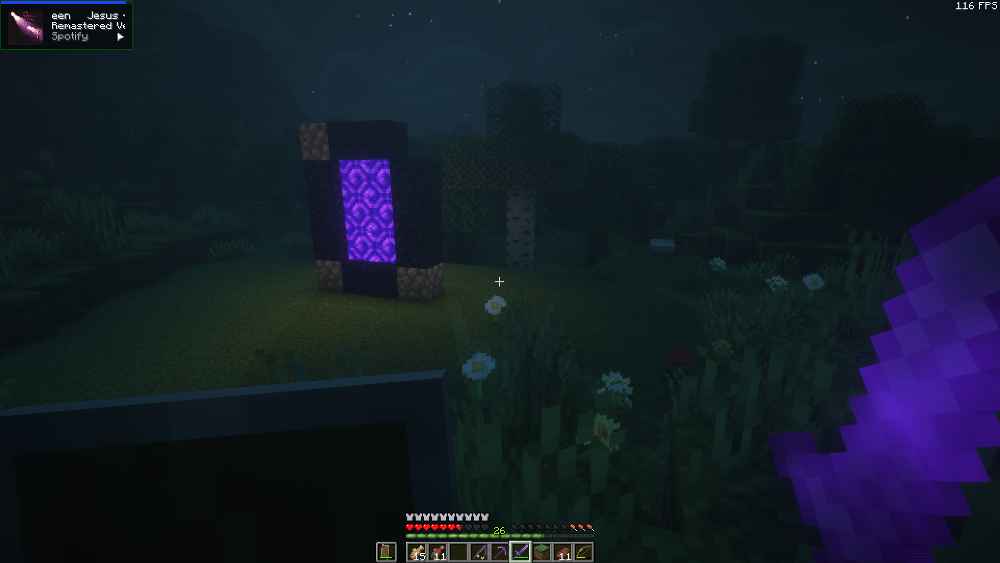
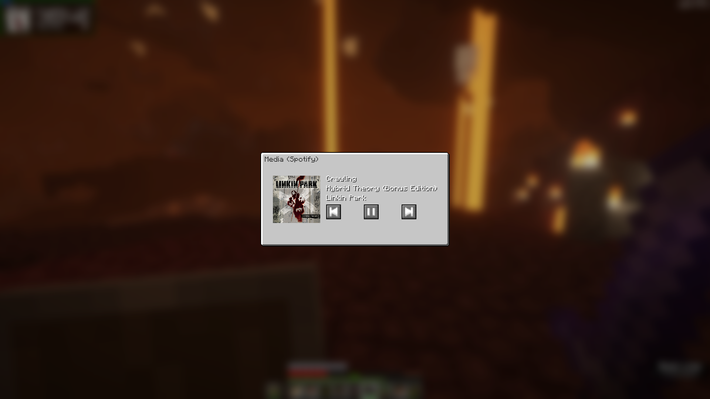

# Kassette
### Modern media information mod for Minecraft
 
Kassette allows you to see and control what is playing in the background, currently only Spotify is supported.

## Setup
(Warning, as of February 11th 2026, Spotify will limit API access to Premium accounts!) 
For the Spotify backend (using their API), you currently need:
- a Spotify Premium account; free accounts cannot create apps using the developer portal!
- a Spotify developer account with an app set up
- a working internet connection

## Screenshots

